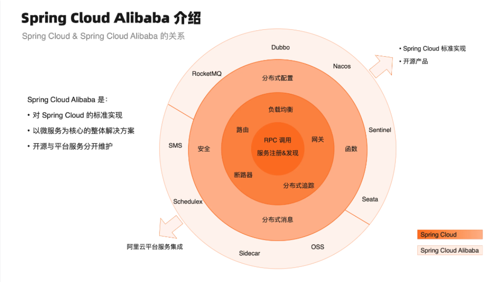
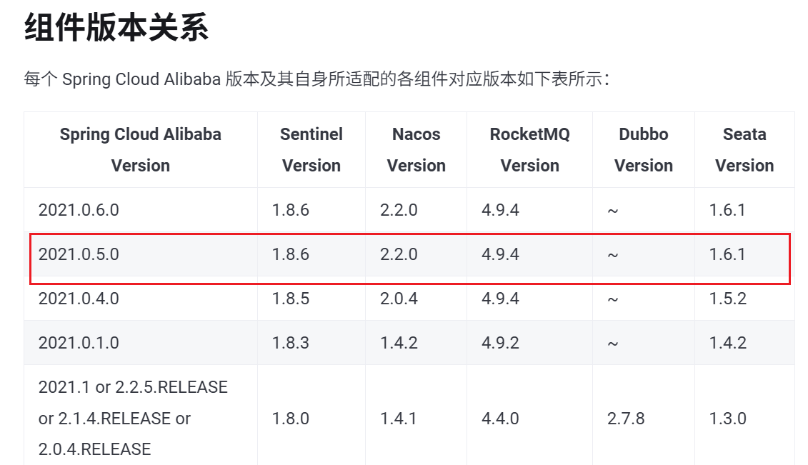
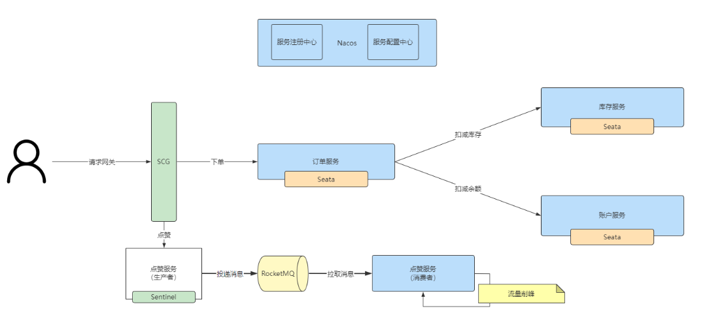

## 跑通整个项目流程

1）移动 questionSubmitController 代码到 questionController 中

2）由于后端改了接口地址，前端需要重新生成接口调用代码

```shell
openapi --input http://localhost:8121/api/v2/api-docs --output ./generated --client axios
```

还需要更改前端调用的 Controller

3）后端调试

4）开发提交列表页面

> 扩展：没隔一段时间刷新一下提交状态，因为后端都是异步判题的


## 单体项目改造为微服务

新建一个项目


### 什么是微服务?

服务：提供某类功能的代码
微服务：专注于提供某类特定功能的代码，而不是把所有的代码全部放到同一个项目里。会把整个大的项目按照一定的功能、逻辑进行拆分，拆分为多个子模块，每个子模块可以独立运行、独立负责一类功能，子模块之间相互调用、互不影响。
一个公司：一个人干活，这个人 icu 了，公司直接倒闭
 一个公司有多个不同类的岗位，多个人干活，一个组跨了还有其他组可以正常工作，不会说公司直接倒闭。各组之间可能需要交互，来完成大的目标。


微服务的几个重要的实现因素：服务管理、服务调用、服务拆分


### 微服务实现技术?

Spring Cloud
Spring Cloud Alibaba (本项目采用)
Dubbo (DubboX)
RPC (GRPC、TRPC)
本质上是通过 HTTP、或者其他的网络协议进行通讯来实现的。


### Spring Cloud Alibaba

推荐版本文档学习：https://sca.aliyun.com/docs/2021/overview/version-explain/?spm=5176.29160081.0.0.74805c72z1SATP





对应版本选择：




Nacos：集中存管项目中所有服务的信息，便于服务之间找到彼此；同时，还支持集中存储整个项目中的配置

整个微服务请求流程：




### 改造前思考

从业务需求出发，思考单机和分布式的区别。
用户登录功能：需要改造为分布式登录
其他内容：
· 有没有用到单机的锁？改造为分布式锁（伙伴匹配系统讲过）
· 有么有用到本地缓存？改造为分布式缓存（Redis）
· 需不需要用到分布式事务？比如操作多个库 


redis 启动：https://blog.csdn.net/weixin_64044840/article/details/133470160?ops_request_misc=%257B%2522request%255Fid%2522%253A%252226f6492f4003854a477f8e2b9e50553c%2522%252C%2522scm%2522%253A%252220140713.130102334


改造分布式登录

1）application.yml 增加 redis 配置

2）补充依赖：

```xml
<!-- redis -->
<dependency>
    <groupId>org.springframework.boot</groupId>
    <artifactId>spring-boot-starter-data-redis</artifactId>
</dependency>
<dependency>
    <groupId>org.springframework.session</groupId>
    <artifactId>spring-session-data-redis</artifactId>
</dependency>
```

3）主类取消 Redis 自动配置的移除

4）修改 session 存储方式：

```yml
spring.session.store-type: redis
```

5）使用 redis-cli 或者 redis 管理工具，查看是否有登录后的信息


### 微服务的划分

> 公司老板对员工分工


依赖服务：

- 注册中心：Nacos
- 微服务网关：Gateway 区和所有的接口，统一接收处理前端的请求


公共模块：

- common 公共模块（yuoj-backend-common）：全局异常处理器、请求响应封装类、公用的工具类等
- model 模型模块（yuoj-backend-model）：很多服务公用的实体类
- 公用接口模块（yuoj-backend-service-client）：只存放接口，不存放实现（多个服务之间要共享）


业务功能

1、题目模块（yuoj-backend-question-service）

1. 创建题目（管理员）
2. 删除题目（管理员）
3. 修改题目（管理员）
4. 搜索题目（用户）
5. 在线做题（题目详情页）
6. 提交题目代码

2、用户模块（yuoj-backend-user-service）

​    a、注册（后端已实现）

​	b、登录（前后端已实现）

​	c、用户管理

3、判题模块（yuoj-backend-judge-service）

​	a、提交判题（结果是否正确）

​	b、错误处理（内存溢出、安全性、超时）

​	c、**自主实现** 代码沙箱（安全沙箱）

​	d、开放接口（提供一个独立的新服务）

> 代码沙箱服务本身就是独立的，不用纳入 Spring Cloud 的管理


#### 路由划分

用 springboot 的 context-path 统一修改各项目的接口前缀，比如：

用户服务：

- /api/user
- /api/user/inner （内部调用，网关层面是要做限制）

题目服务：

- /api/question （也包括题目提交信息）
- /api/question /inner （内部调用，网关层面是要做限制）

判题服务：

- /api/judge
- /api/judge/inner （内部调用，网关层面是要做限制）


### Nacos 注册启动

要选择 2.2.0 版本

快速启动文档参考：https://nacos.io/docs/v2/quickstart/quick-start/?spm=5238cd80.2ef5001f.0.0.3f613b7csdmY8y

默认登录账号和密码：nacos / nacos

#### Windows

启动命令(standalone代表着单机模式运行，非集群模式):

```shell
startup.cmd -m standalone
```


#### 新建工程

Spring Cloud 有相当多的依赖，参差不齐，不建议随意找一套配置，可以建立一个属于自己的配置

建议使用脚手架：https://start.aliyun.com/

给项目增加全局依赖配置文件。

创建完初始项目后，补充 Spring  Cloud 依赖：

```xml
<dependency>
    <groupId>org.springframework.cloud</groupId>
    <artifactId>spring-cloud-dependencies</artifactId>
    <version>2021.0.5</version>
    <type>pom</type>
    <scope>import</scope>
</dependency>
```


依次使用new modules 和 spring boot 创建新模块

需要给各模块之间绑定子父依赖关系，父模块定义 modules，子模块引入 parent 语法，可以通过继承父模块配置，统一项目的定义和版本号


### 同步代码和依赖

1）common 公共模块（yuoj-backend-common）：全局异常处理器、请求响应封装类、公用的工具类等

更改和同步依赖：

```xml
<!-- https://mvnrepository.com/artifact/org.apache.commons/commons-lang3 -->
        <dependency>
            <groupId>org.apache.commons</groupId>
            <artifactId>commons-lang3</artifactId>
        </dependency>
        <!-- https://hutool.cn/docs/index.html#/-->
        <dependency>
            <groupId>cn.hutool</groupId>
            <artifactId>hutool-all</artifactId>
            <version>5.8.8</version>
        </dependency>
        <!-- https://mvnrepository.com/artifact/com.google.code.gson/gson -->
        <dependency>
            <groupId>com.google.code.gson</groupId>
            <artifactId>gson</artifactId>
            <version>2.9.1</version>
        </dependency>
        <!-- https://mvnrepository.com/artifact/org.apache.commons/commons-collections4 -->
        <dependency>
            <groupId>org.apache.commons</groupId>
            <artifactId>commons-collections4</artifactId>
            <version>4.4</version>
        </dependency>
 <!-- https://mvnrepository.com/artifact/com.baomidou/mybatis-plus-boot-starter -->
        <dependency>
            <groupId>com.baomidou</groupId>
            <artifactId>mybatis-plus-boot-starter</artifactId>
            <version>3.5.2</version>
        </dependency>
```

2）model 模型模块（yuoj-backend-model）：很多服务公用的实体类

直接复制 model 包，注意代码沙箱 model 的引入


3）公用接口模块（yuoj-backend-service-client）：只存放接口，不存放实现（多个服务之间要共享）

先搬运所有的 service	


4）具体业务服务实现

给所有业务服务引入公共依赖：

```xml
<dependency>
    <groupId>com.yupi</groupId>
    <artifactId>yuoj-backend-common</artifactId>
    <version>0.0.1-SNAPSHOT</version>
</dependency>
<dependency>
    <groupId>com.yupi</groupId>
    <artifactId>yuoj-backend-service-client</artifactId>
    <version>0.0.1-SNAPSHOT</version>
</dependency>
<dependency>
    <groupId>com.yupi</groupId>
    <artifactId>yuoj-backend-model</artifactId>
    <version>0.0.1-SNAPSHOT</version>
</dependency>
```


### 服务内部调用

问题：题目服务依赖用户服务，但是代码已经到不同的包，找不到对应的 Bean

可以使用 Open Feign 组件实现跨服务的远程调用

Open Feign： Http调用客户端，提供了更方便的方式让你调用其他服务，不用关心服务的调用地址

Nacos 注册中心获取服务调用地址 


1）梳理服务的调用关系，确定哪些服务（接口）需要给内部调用

用户服务：沒有其他的依赖

题目服务：

```java
userService.getById(userId)
userService.getUserVO(user)
userService.listByIds(userIdSet)
userService.isAdmin(loginUser)
userService.userLogout(request)
```

判题服务：

```java
questionService.getById(questionId)
questionSubmitService.getById(questionSubmitId)
questionSubmitService.updateById(questionSubmitUpdate)
```


2）确定要哪些服务

用户服务：

```java
userService.getById(userId)
userService.getUserVO(user)
userService.listByIds(userIdSet)
userService.isAdmin(loginUser)
userService.userLogout(request)
```

题目服务：

```java
questionService.getById(questionId)
questionSubmitService.getById(questionSubmitId)
questionSubmitService.updateById(questionSubmitUpdate)
```

判题服务：

```java
judgeService.doJudge(questionSubmitId)
```


3）实现 client 接口


对于用户服务，有一些不利于远程调用参数传递、或者实现起来非常简单（工具类），可以直接用默认方法，无需远程调用，节约性能


开启 openfeign 的支持，把我们的接口暴露出去（服务注册到注册中心上），作为 API 给其他服务调用（其他服务从注册中心寻找）


需要修改每个服务提供者的 context-path 全局请求路径

```yml
server:
  address: 0.0.0.0
  port: 8103
  servlet:
    context-path: /api/judge
```


服务提供者：理解为接口的实现类，实际提供服务的模块

服务消费者：理解为接口的调用方，需要去找到服务提供者，然后调用


注意事项：

1. 要给接口的每个方法打上请求注解，注意区分 Get、Post
2. 要给请求参数打上注解，比如 RequestParam、RequestBody
3. FeignClient 定义的请求路径一定要和服务提供方实际的请求路径保持一致


示例代码：

```java
/**
 * 用户服务
 *
 * @author <a href="https://github.com/liyupi">程序员鱼皮</a>
 * @from <a href="https://yupi.icu">编程导航知识星球</a>
 */

@FeignClient(name = "yuoj-backend-user-service", path = "/api/user/inner")
public interface UserFeignService {


    /**
     * 根据 id 获取用户
     * @param userId
     * @return
     */
    @GetMapping("/get/id")
    User getById(@RequestParam("userId") long userId);


    /**
     * 根据 id 获取用户列表
     * @param idList
     * @return
     */
    @GetMapping("/get/ids")
    List<User> listByIds(@RequestParam("idList") Collection<Long> idList);

    /**
     * 获取当前登录用户
     *
     * @param request
     * @return
     */
    default User getLoginUser(HttpServletRequest request){
        // 先判断是否已登录
        Object userObj = request.getSession().getAttribute(USER_LOGIN_STATE);
        User currentUser = (User) userObj;
        if (currentUser == null || currentUser.getId() == null) {
            throw new BusinessException(ErrorCode.NOT_LOGIN_ERROR);
        }
        return currentUser;
    }

    /**
     * 是否为管理员
     *
     * @param user
     * @return
     */
    default boolean isAdmin(User user){
        return user != null && UserRoleEnum.ADMIN.getValue().equals(user.getUserRole());
    }

    /**
     * 获取脱敏的用户信息
     *
     * @param user
     * @return
     */
    default UserVO getUserVO(User user){
        if (user == null) {
            return null;
        }
        UserVO userVO = new UserVO();
        BeanUtils.copyProperties(user, userVO);
        return userVO;
    }


}
```


4）修改各业务服务的调用代码为 feignClient

5）编写服务的实现类，注意要和之前定义的客户端保持一致	

6）开启 Nacos 的配置，让服务之间能够互相发现

所有模块引入 Nacos 依赖，然后给业务服务（包括网关）增加配置：

```yml
spring:
   cloud:
    nacos:
      discovery:
        serverAddr: 127.0.0.1:8848
```


给业务服务项目启动类打上注解，开启服务发现、找到对应的客户端 Bean 的位置：

```java
@EnableDiscoveryClient
@EnableFeignClients(basePackages = {"com.yupi.yuojbackendserviceclient.service"})
```

7）启动项目，测试依赖能否注入，能否完成相互调用


### 微服务网关

微服务网关（yuoj-backend-gateway）：Gateway 聚合所有的接口，统一接受处理前端的请求
为什么要用？

- 所有的服务端口不同，增大了前端调用成本
- 所有服务是分散的，你可需要集中进行管理、操作，比如集中解决跨域、鉴权、接口文档、服务的路由、接口安全性、流量染色 

> Gateway：想自定义一些功能，需要对这个技术有比较深的理解


Gateway 是应用层网关：会有一定的业务逻辑（比如根据用户信息判断权限）
Nginx 是接入层网关：比如每个请求的日志，通常没有业务逻辑


#### 接口路由

统一地接受前端的请求，转发请求到对应的服务

如何找到路由？可以编写一套路由配置，通过 api 地址前缀来找到对应的服务。

```yml
spring:
  cloud:
    nacos:
      discovery:
        serverAddr: 127.0.0.1:8848
    gateway:
      routes:
        - id: yuoj-backend-user-service
          uri: lb://yuoj-backend-user-service
          predicates:
            - Path=/api/user/**
        - id: yuoj-backend-question-service
          uri: lb://yuoj-backend-question-service
          predicates:
            - Path=/api/question/**
        - id: yuoj-backend-judge-service
          uri: lb://yuoj-backend-judge-service
          predicates:
            - Path=/api/judge/**
  application:
    name: yuoj-backend-gateway
  main:
    web-application-type: reactive
server:
  port: 8101
```


#### 聚合文档

以一个全局的视角中查看管理接口文档

使用 Knife4j 接口文档生成器：https://doc.xiaominfo.com/docs/middleware-sources/spring-cloud-gateway/spring-gateway-introduction

1）先给所有业务服务引入依赖，同时开启接口文档的配置

依赖：

```xml
<dependency>
    <groupId>com.github.xiaoymin</groupId>
    <artifactId>knife4j-openapi2-spring-boot-starter</artifactId>
    <version>4.3.0</version>
</dependency>
<dependency>
    <groupId>com.github.xiaoymin</groupId>
    <artifactId>knife4j-gateway-spring-boot-starter</artifactId>
    <version>4.3.0</version>
</dependency>
```

配置：

```yml
knife4j:
  enable: true
```


2）给网关集合管理文档

引入依赖:

```xml
<dependency>
    <groupId>com.github.xiaoymin</groupId>
    <artifactId>knife4j-gateway-spring-boot-starter</artifactId>
    <version>4.3.0</version>
</dependency>
```


引入配置：

```yml
knife4j:
  gateway:
    # ① 第一个配置，开启gateway聚合组件
    enabled: true
    # ② 第二行配置，设置聚合模式采用discover服务发现的模式
    strategy: discover
    discover:
      # ③ 第三行配置，开启discover模式
      enabled: true
      # ④ 第四行配置，聚合子服务全部为Swagger2规范的文档
      version: swagger2

```


3）访问地址即可查看聚合接口文档：


#### 分布式 session 登录

必须引入spring data redis 依赖：

```xml
<!-- redis -->
<dependency>
    <groupId>org.springframework.boot</groupId>
    <artifactId>spring-boot-starter-data-redis</artifactId>
</dependency>
<dependency>
    <groupId>org.springframework.session</groupId>
    <artifactId>spring-session-data-redis</artifactId>
</dependency>
```

解决 cookie 跨路径问题：

```yml
server:
  address: 0.0.0.0
  port: 8104
  servlet:
    context-path: /api/judge
    # cookie 30 天过期
    session:
      cookie:
        max-age: 2592000
        path: /api
```


#### 跨域解决

全局解决跨域配置：

```java
// 处理跨域
@Configuration
public class CorsConfig {

    @Bean
    public CorsWebFilter corsFilter() {
        CorsConfiguration config = new CorsConfiguration();
        config.addAllowedMethod("*");
        config.setAllowCredentials(true);
        // todo 实际改为线上真实域名、本地域名
        config.setAllowedOriginPatterns(Arrays.asList("*"));
        config.addAllowedHeader("*");
        UrlBasedCorsConfigurationSource source = new UrlBasedCorsConfigurationSource(new PathPatternParser());
        source.registerCorsConfiguration("/**", config);
        return new CorsWebFilter(source);
    }
}
```


#### 权限校验

可以使用 Spring Cloud Gateway 的 Filter 请求拦截器，接收到请求后根据请求的路径判断能够访问

```java
@Component
public class GlobalAuthFilter implements GlobalFilter, Order {

    private AntPathMatcher antPathMatcher = new AntPathMatcher();


    @Override
    public Mono<Void> filter(ServerWebExchange exchange, GatewayFilterChain chain) {
        ServerHttpRequest serverHttpRequest = exchange.getRequest();
        String path = serverHttpRequest.getURI().getPath();
        // 判断路径中是否包含 inner，只允许内部调用
        if (antPathMatcher.match("/**/inner/**", path)) {
            ServerHttpResponse response = exchange.getResponse();
            response.setStatusCode(HttpStatus.FORBIDDEN);
            DataBufferFactory dataBufferFactory = response.bufferFactory();
            DataBuffer dataBuffer = dataBufferFactory.wrap("无权限".getBytes(StandardCharsets.UTF_8));
            return response.writeWith(Mono.just(dataBuffer));
        }
        return chain.filter(exchange);
    }

    /**
     * 权限提到最高
     * @return
     */
    @Override
    public int order() {
        return 0;
    }
}
```


> 扩展：可以在网关实现接口限流降级：https://sca.aliyun.com/docs/2021/user-guide/sentinel/quick-start/?spm=7145af80.1570e059.0.0.3ad52fa5FHPmKk
>
> 扩展：可以使用 JWT Token 实现用户登录，在网关层面通过 token 获取登录信息，实现鉴权


### 思考

真的有必要用微服务么？
真的有必要用 Spring Cloud 实现微服务么？
企业内部一般使用 API（RPC、HTTP）实现跨部门、跨服务的调用，数据格式和调用代码全部自动生成，保持统一，同时解耦。


### 消息队列解耦

此处选用消息队列改造项目，解耦判题服务和题目服务，题目服务只需要向消息队列发消息，判题服务从消息队列中取消息去执行判题，然后异步更新数据库即可。


### RabbitMQ

```shell
rabbitmq-plugins.bat enable rabbitmq_management
```


访问http://localhost:15672/#/


